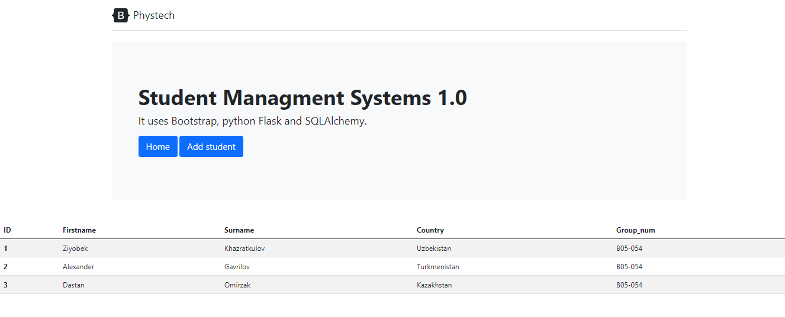
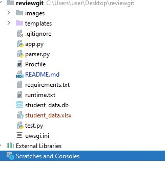
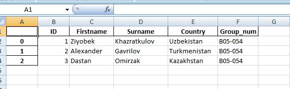

<!-- PROJECT LOGO -->
<br />
<p align="center">
  <a href="#">
    
  </a>

  <a href="https://phystech-server.herokuapp.com/home">
    <h3 align="center">Student Managment Systems 1.0</h3>
  </a>
  <p align="center">
    by Khazratkulov Ziyobek
    <br />
    
  </p>
</p>

<!-- TABLE OF CONTENTS -->
<details open="open">
  <summary><h2 style="display: inline-block">Table of Contents</h2></summary>
  <ol>
    <li>
      <a href="#about-the-project">About The Project and Usage</a>
      <ul>
        <li><a href="#description">Description content of the code</a></li>
        <li><a href="#built-with">Built With</a></li>
      </ul>
    </li>
    <li>
      <a href="#parse">Parsing table and testing</a>
      <ul>
        <li><a href="#installation">Installation</a></li>
        <li><a href="#parse">Parsing table</a></li>
        <li><a href="#test">Testing</a></li>
      </ul>
    </li>
    <li><a href="#contact">Contact</a></li>
  </ol>
</details>


<!-- ABOUT THE PROJECT -->
<details open="open">
<summary><h2 style="display: inline-block">About the Projectand Usage</h2></summary>


This project Student Managment Systems. It is just first version. This project is a student data registration. The project is homework Python programming practice Review_2.

Project deployed on Heroku, link <a href="https://phystech-server.herokuapp.com/home">here</a>

You should enter your information and they will appear on main page. A detailed example is shown below:\
<br>

<br>

<br>

<br>

<br>

<br>

### Description content of the code
* Directories:\
    <b>images</b> - the directory, where the pictures are located.\
    <b>templates</b> - the directory, where the html files are located\
* Files:\
    <b>Profile, requirements.txt, runtime.txt, uwsgi.ini</b> - files, which is used for deploying on heroku.\
    <b>app.py</b> - main executable file on project\
    <b>parser.py</b> - file that parses the student data table and creates a file on which all the information appears\
    <b>test.py</b> - file for testing our project\
    <b>student_data.db</b> - the database on which all the data is located


### Built with
* [Bootstrap](https://getbootstrap.com) - free set of tools for creating websites and web applications.
* [Flask](https://palletsprojects.com/p/flask/) - framework for creating web applications in the Python programming language
* [Flask_SQLAlchemy](https://flask-sqlalchemy.palletsprojects.com/en/2.x/) - this is a set of SQL tools for Python
* [Pandas](https://pandas.pydata.org/docs/) - software library in Python for data processing and analysis.Used to parse a table from the main page
* [Unittest](https://docs.python.org/3/library/unittest.html) - testing tool in Python

</details>


<!-- PARSING AND TESTING -->
<details open="open">
<summary><h2 style="display: inline-block">Parsing table and testing</h2></summary>

### Installation

1. Clone the repo
   ```sh
   git clone https://github.com/Khazratkulov-Ziyobek/Phystech-server.git
   ```
2. Or download zip form
    
3. Install neccessary pockets:
    ```sh
    - pip install flask
    - pip install flask_sqlalchemy
    - pip install pandas
    - pip install lxml
    - pip install openpyxl
    - pip install unittest
    ```
### Parsing table
  ```sh
    Type "python parse.py".
  ```
Then'student_data.xlsx' appears:
    <br>



Finally, we can see table from this file:
    <br>




### Testing
```sh
For testing type "python test.py"
```
</details>


<!-- CONTACT -->
<details open="open">
<summary><h2 style="display: inline-block">Contact</h2></summary>

Telegram account  - [@Khazratkulov_Z](https://web.telegram.org/#/login)

Email - [khazratkulov.zt@phystech.edu]()

Project link - https://github.com/Khazratkulov-Ziyobek/Phystech-server
</details>